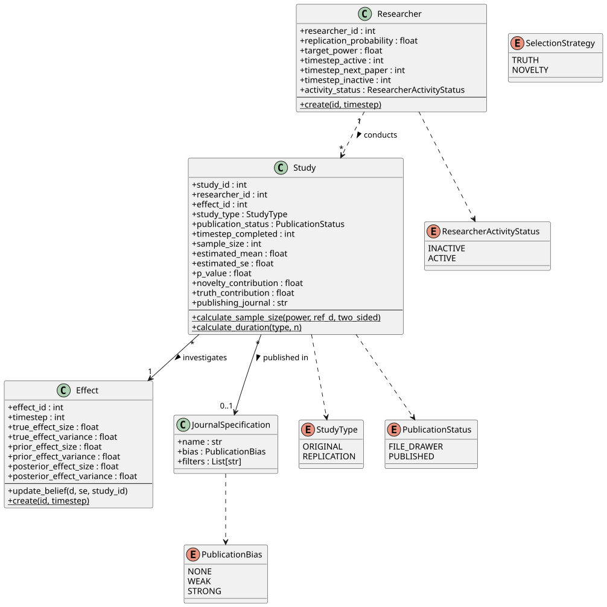

<!-- The introduction should not have a level-1 heading such as Introduction. -->

## Replication Crisis

Modern empirical science relies on the assumption that research findings are not unique historical events, but results that can be independently verified.

Two concepts are central, when we try to evaluate our research by holding it to the standards implied by this assumption: reproducibility and replicability.

Reproducibility refers to the ability to obtain the same results when the original data are reanalyzed using the same methods, code, and analytical decisions. Replication, by contrast, involves collecting new data—often following the original design as closely as possible, to test whether the reported effect can be observed again in an independent sample. Together, these practices serve as core mechanisms for quality control in empirical research. The term replication crisis denotes the growing concern that a substantial share of published findings, particularly in psychology, fail to reproduce or replicate at rates that would be expected given their reported statistical support. This concern has motivated increased scrutiny of research practices, evidential standards, and the institutional incentives shaping scientific knowledge production.

Since @opensciencecollaborationEstimatingReproducibilityPsychological2015 tried to replicate 100 studies published in several scientific journals of psychology, we know that most of the findings (as much as two thirds) of our psychological research is not reproducible. 97% of the original studies had significant results, while only 36% of the replications did. The researchers subjectively rated 39% of the results as successfully replicated. This was an attempt for introspection in psychology. After decades of research, the scientific community itself tried to evaluate their standing. These finding triggered a larger scale movement, mainly in psychology, but also globally in the scientific community.

Us being aware of the questions of the quality of our research, and its main output, publications, go further back. The concerns related to our published results, and more structured attempts at soberly evaluating the current situation dates back at least a few decades. Leaving empirical studies of replicability and reproducibility aside, @ioannidisWhyMostPublished2005, focusing on biomedical research, argued that the majority of published research findings are false. He put it bluntly: "It can be proven that most claimed research findings are false." According to him, this is not a surprise, or not a direct sign that the scientific method is broken. For Ioannidis, this is related to several factors such as low statistical power, small true effects, flexible analyses, biased incentives, publication bias.

The fact, that we are not able to replicate or reproduce most of our findings does not speak for itself. It was, and still is, a challenge to interpret the perceived situation, and arrive at conclusions regarding the meaning of our inability to replicate our findings. For @maxwellPsychologySufferingReplication2015, the results our understanding of the *Replication Crisis* is based on might not point at a problem at all, but rather are a direct consequence of inadequate replications (e.g. low statistical power of replication studies). 

## The Problem

Looking at the results of replication studies and seeing how they fail to arrive at the same conclusions as their corresponding original studies, it is intuitive to think that it is *bad* that we are not able to replicate most of our findings and be disappointed.

There is no *good* or *bad*, or disappointment to be seen in numbers. Any similar reaction is based on and informed by our implicit or explicit view of what 'science' is supposed to do. Why do we research? What is 'science' supposed to produce. If the metric of good science was number of publications, our scientific methods would be highly adequate [@bornmannGrowthRatesModern].

The goals of psychological science are usually defined as describing behavior, explaining why it occurs, predicting when it will occur, and controlling or influencing behavior through interventions. All of these goals could be understood to be based on things in common: (1) understanding how and why something happens, (2) in the scope of human experience and behavior. It is, semantically loosely transformed, producing knowledge. And this knowledge is supposed to approximate 'reality' (i.e. how and why things happen in the real world) as closely as possible. And knowledge, that is a good representation of 'reality', can be called 'truth'. Depending on these considerations, the goal of psychology can be understood as producing 'truths' regarding human experience and behavior.

If we accept this view, then the inability to replicate or reproduce most of our findings is a problem since it challenges the validity of our knowledge. Which, in turn, challenges the 'truths' we claim to have produced. Hence, it is a crisis of science.

## Goal

We want to understand, how research fails to produce 'truths' and how we can improve it.

The scientific system, with its researchers, institutions and products, is a complex system with many moving parts. It is not a system that can be easily understood using a broad bird's eye view and simple heuristics.

We pick agent-based modeling as our tool, which will be described in detail in the next section.

# Method: Agent-Based Modeling

## 

# Theoretical Implementation: Imagining an Agent-Based Model of the Scientific Community

## The Idea

The model conceptualizes the scientific community as a complex adaptive system composed of interacting entities that collectively generate, evaluate, and stabilize scientific knowledge over discrete time steps. At its core, the system is decomposed into four interacting components: **researchers**, **effects**, **studies**, and **journals**. Together, these elements define both the production of empirical claims and the selective pressures shaping scientific practice.

With this model at hand, we can run experiments on the scientific system that would never be possible in the real world. Since our goal with creating this model is running in silico experiments, easy configurability is a key consideration and a goal of the implementation. The configuration options we choose to expose determine the possible set of alternative scientific systems we can simulate. 

## Decomposition

### Entities

Taken together, the agent-based framework allows the dynamics of scientific knowledge production to emerge from local interactions between agents, a structured environment of effects, and institutionally defined selection mechanisms.

#### Researchers

Researchers constitute the primary agents of the model.

In particular, researchers differ in their probability of conducting replication studies rather than original investigations, as well as in the level of statistical power they target when designing studies, which determines sample size.

In addition to these traits, researchers have state variables that regulate their activity over time, including the timestep at which their current project is completed and their activity status (active or inactive).

Publication success feeds back into survival and reproduction within the population, implementing an evolutionary dynamic at the level of research strategies. It is important to note that researchers do not change their traits and adapt to the current environment over time during their careers (i.e. the time frame they are active in.), that is to say, individual researcher do not learn. Only adaptation in this model happens at the population level.

#### Effects

Effects represent phenomena in the real world. The list of available effects is a quite simplified version of 'reality'.

Each effect has a fixed true effect size that exists independently of scientific observation. The majority of effects are null, while non-null effects are drawn from a continuous distribution. Beyond this ground truth, each effect also has a belief state that represents the aggregated knowledge of the scientific community. This belief state is encoded as a posterior distribution over effect sizes and is updated via Bayesian inference whenever new studies are published.

The implementation of the idea of an effect encapsulates the hard reality and the social aspect of the effect. They define the world, and they keep track of what researchers believe about them. 

#### Studies

Studies are the objects produced by researchers, they represent the observation of an effect.

A study is instantiated when a researcher completes a project and generates data from an underlying effect.

Studies are either original investigations of previously unstudied effects or replications of effects that have already entered the literature.

Their design is determined by the researcher’s targeted power, which fixes the sample size. Each study produces standard inferential outputs, including a p-value, an observed effect size, and an associated standard error. Beyond these conventional metrics, studies are also evaluated in terms of their epistemic contribution.

#### Journals

Journals constitute the selection mechanism of the system. They act as gatekeepers that determine which studies become part of the public scientific record and which disappear into the file drawer.

Journals differ in their selection biases, ranging from unbiased acceptance to weak or strong preferences for statistically significant results and high novelty. Some journals impose additional scope restrictions, such as accepting only replication studies.

The submission process follows a 'shopping around' logic: a study may be sequentially submitted to multiple journals in random order until it is accepted or all options are exhausted. Through this process, journals impose structured selection pressures that shape both the published literature and the long-term evolution of researcher behavior.

## Other Concepts

### Evaluating Researchers' Lives' Work

Researchers' careers are evaluated based on the epistemic contribution of their published studies. In this model, we define two types of epistemic contribution: novelty contribution and truth contribution.

#### Novelty Contribution

Novelty contribution quantifies how much a study shifts the community’s belief, operationalized as the divergence between prior and posterior distributions of community beliefs regarding the effects. If a study produced a result that is very different compared to the preceding studies, it is assigned a higher novelty contribution.

#### Truth Contribution

Truth contribution quantifies how much a study aligns with the true effect size, operationalized as the divergence between true effect size and posterior effect size. If a study produced a result that is very close to the true effect size, it is assigned a higher truth contribution.

### Deciding What Gets Published

#### Publication Bias

Publication bias is how selective journals are in accepting studies. The key factor is that journals do not accept or reject studies based on the quality, but rather on other factors such as statistical significance and novelty (in this model).

## The Simulation Run

The simulation advances in discrete timesteps that represent the passage of time within the scientific community. In each timestep, the system executes a fixed sequence of three phases: researcher action, peer review, and career evolution. This scheduling ensures a clear separation between knowledge production, institutional selection, and long term population dynamics.

### Researcher Action

#### Original Study or Replication

At the beginning of each timestep, the system enters the researcher action phase. All researchers who are currently active and not occupied with an ongoing project are identified. Each of these researchers makes a stochastic decision about how to allocate their resources. First, the researcher selects a research strategy, choosing between conducting a replication study or an original study. This choice is based on the researcher’s individual replication probability trait.

#### Selecting a Target (Effect/Study)

After selecting a strategy, the researcher selects a target. If replication is selected, the researcher surveys the existing literature and searches for published effects that are eligible for replication. If no valid replication targets are available, the researcher defaults to conducting an original study. If an original study is chosen from the outset, the researcher selects a previously unstudied effect from the environment.

#### Conducting the Study

Once a target has been selected, the researcher commits to executing the study. The duration of the project is proportional to the required sample size, which is determined by the researcher’s target power. During this period, the researcher is marked as busy and cannot initiate additional projects. This dynamic represnts the time it takes to conduct a study in the real world. When the study is completed, data are generated based on the 'true effect' of the target effect, producing an observed effect size and an associated p-value.

In each step, new studies are started as long as the preconditions are met (i.e., the researcher is not busy and there are available effects waiting to be studied).

### Publication

After the research phase, the simulation enters the peer review phase, which models the process of submission and editorial selection. Each study is submitted sequentially to the available journals. The order of submission is randomized. Researchers submit their studies to the journals until (1) a journal accepts their study, (2) they don't have any journals left to submit to or (3) the maximum number of submissions per study is reached. Each journal evaluates the study according to its own criteria, for this model, simply the publication bias plus some specific inclusion/exclusion criteria. An example for a journal with specified inclusion criteria is a replication journal, which strictly only accepts replication studies. 

#### Community Belief Update

If a journal accepts the study, it becomes part of the public scientific record. Acceptance triggers an update of the community’s aggregate belief about the corresponding effect, implemented through Bayesian inference. If the study is rejected, it is submitted to the next journal in the sequence. If all journals reject the study, it is assigned to the file drawer. In this case, the study has no impact on collective knowledge, and the community belief state remains unchanged.

### Career Turnover

At regular intervals, every N timesteps (configurable), the simulation enters the career turnover phase. This phase represents the long term demographic dynamics of academia and introduces selection pressure on researchers. All researchers are evaluated based on their recent performance within the preceding career window. The evaluation metric depends on the global selection regime.

#### Fire and Hire Researchers

Under selection for novelty, researchers are rewarded for the cumulative novelty contribution of their published papers. Under selection for truth, researchers are rewarded for the cumulative truth contribution, measured as information gain toward the true effect, again restricted to published work.

Researchers are then ranked according to their scores, and the lowest performing fraction is removed from the simulation. To maintain a constant population size, new researchers are introduced to replace those who exit. Each new researcher is generated as the offspring of a surviving researcher and inherits the parent’s behavioral traits, including replication probability and target power, with small random mutations. This reproductive mechanism allows successful research strategies to propagate over evolutionary time, while unsuccessful strategies gradually disappear from the population.

# Technical Implementation

## Tools

The idea of this model based on the theoretical considerations as described in the previous section can be technically realized using many tools and environments.

The choice of tools should be based on the constraints of the theoretical model, performance needs and the ease of implementation and communication.

This section discusses those constraints and justifies our choices.

## Constraints

## The Code

{#fig-uml}

For 

# Experiments

## Setting the Stage: The Configuration of Experiments

# Results

# Discussion

## Limitations and Future Directions

## Conclusion

# References

<!-- References will auto-populate in the refs div below -->

::: {#refs}
:::

# Configuration Options {#apx-a}

| Flag | Default | Description |
| :--- | :--- | :--- |
| **Population** | | |
| `--researchers` | `500` | Total number of active agents in the community. |
| `--effects` | `100,000` | The "Universe of Facts" available to be discovered. |
| **Time & Evolution** | | |
| `--timesteps` | `300` | Total duration of the simulation. |
| `--career_steps` | `35` | How often (in timesteps) career evaluations/hiring occur. |
| **Peer Review** | | |
| `--bias` | `1` (Weak) | Publication bias level of journals. `0`: None (No bias) `1`: Weak (Preferences sig. and novelty) `2`: Strong (Highly discriminative)|
| `--replication_journal`| `1` (True) | Include "Replication Reports" journal (accepts only replications, no bias). `0`: No `1`: Yes|
| **Researcher Strategy** | | |
| `--selection` | `1` (Novelty) | Selection pressure for career advancement. `0`: Truth (Rewards aligning belief with truth) `1`: Novelty (Rewards shifting belief regardless of truth)|
| `--max_replications` | `None` | Hard limit on replications per effect. If set (e.g. `2`), researchers stop replicating an effect once it hits the count.|
| **System** | | |
| `--output` | `simulation_output` | Filename prefix for the generated CSV statistics. |
| `--visualize` | `False` | Launch the real-time matplotlib dashboard. |

# Declaration on the Use of Generative AI in Programming {#apx-b}

In the preparation of this document, I have used the following tools:

- Gemini 3 Pro (Google) integrated in Antigravity (Google)

**Type of use:**

- Generation of boilerplate code, e.g. `main.py` for developing the CLI.
- Improvement of code quality and readability.
- Cleanup of code.
- Creating of PlantText UML diagrams based on existing classes.

Munich, January 12, 2026

Alp Kaan Aksu

_________________________

# Declaration on the Use of Generative AI in the Writing Process {#apx-c}

In the preparation of this document, I have used the following tools:

- ChatGPT 5.2 (OpenAI)

**Type of use:**

- Improvement of linguistic quality and readability. 

After using this tool, I reviewed and edited the content as needed and take full responsibility for the content of this document. I confirm that this work does not contain any extended passages (e.g., summary/abstract of the paper, entire paragraphs) consisting solely of AI-generated text.

Munich, January 12, 2026

Alp Kaan Aksu

_________________________

# Eidesstattliche Erklärung {#apx-d}

Hiermit versichere ich, dass ich die vorliegende Arbeit selbstständig verfasst habe und keine anderen als die angegebenen Quellen und Hilfsmittel benutzt habe. Die aus fremden Quellen direkt oder indirekt übernommenen Gedanken sind als solche kenntlich gemacht worden. Die Arbeit wurde bisher keiner anderen Prüfungsbehörde vorgelegt und auch noch nicht veröffentlicht.

München, den 12. Januar 2026

Alp Kaan Aksu

_________________________