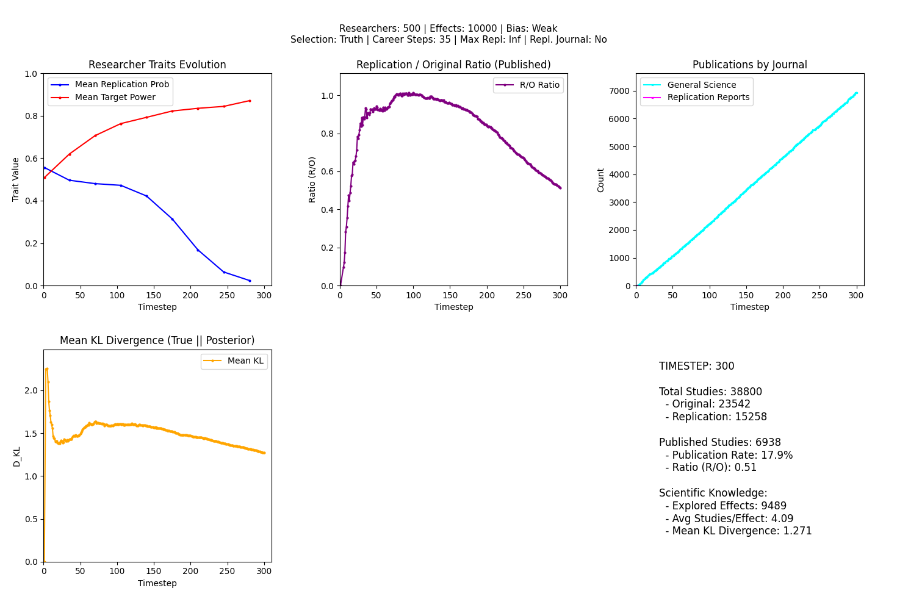
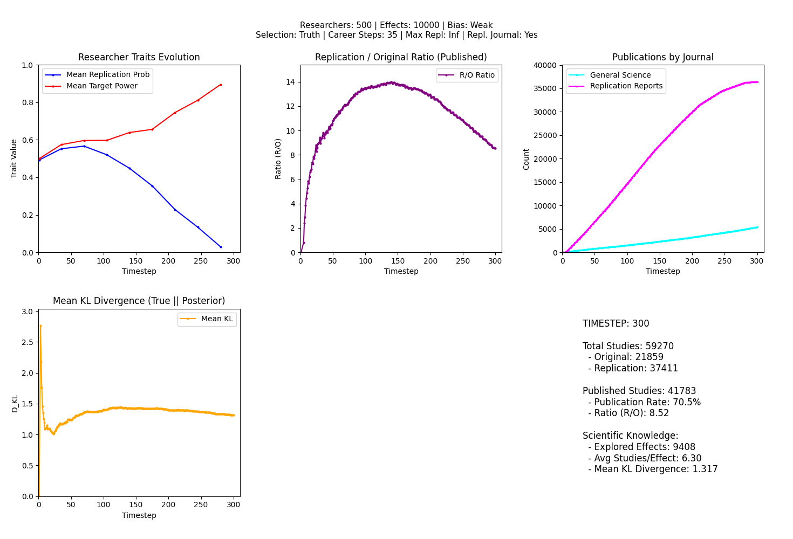
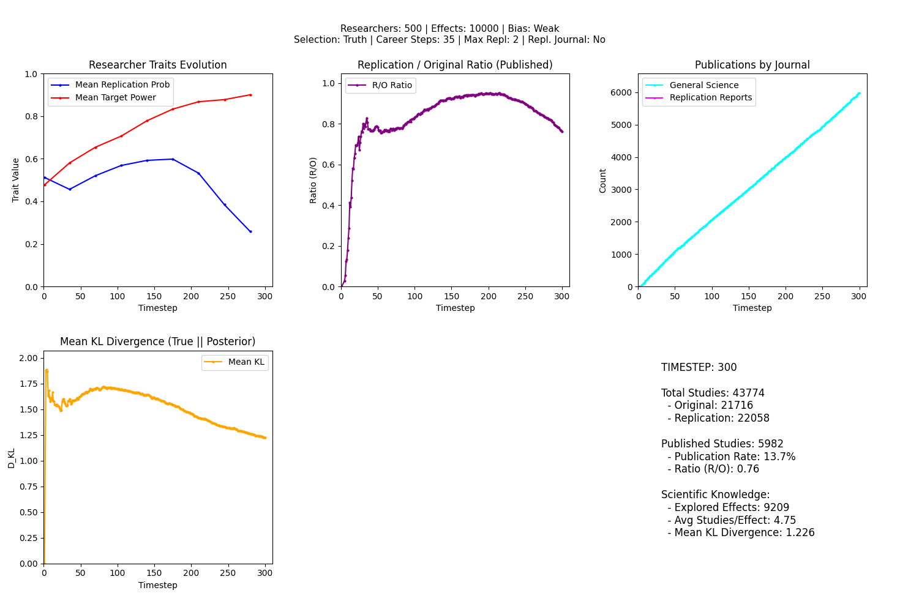
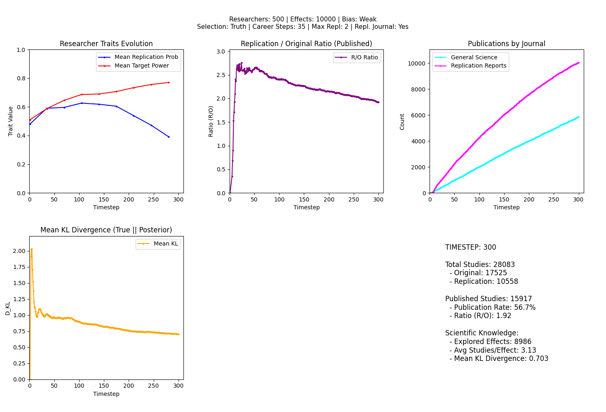

<!-- The introduction should not have a level-1 heading such as Introduction. -->

## Replication Crisis

Modern empirical science relies on the assumption that research findings are not unique historical events, but results that can be independently verified.

Two concepts are central, when we try to evaluate our research by holding it to the standards implied by this assumption: reproducibility and replicability.

Reproducibility refers to the ability to obtain the same results when the original data are reanalyzed using the same methods, code, and analytical decisions. Replication, by contrast, involves collecting new data—often following the original design as closely as possible, to test whether the reported effect can be observed again in an independent sample. Together, these practices serve as core mechanisms for quality control in empirical research. The term replication crisis denotes the growing concern that a substantial share of published findings, particularly in psychology, fail to reproduce or replicate at rates that would be expected given their reported statistical support. This concern has motivated increased scrutiny of research practices, evidential standards, and the institutional incentives shaping scientific knowledge production.

Since @opensciencecollaborationEstimatingReproducibilityPsychological2015 tried to replicate 100 studies published in several scientific journals of psychology, we know that most of the findings (as much as two thirds) of our psychological research is not reproducible. 97% of the original studies had significant results, while only 36% of the replications did. The researchers subjectively rated 39% of the results as successfully replicated. This was an attempt for introspection in psychology. After decades of research, the scientific community itself tried to evaluate their standing. These finding triggered a larger scale movement, mainly in psychology, but also globally in the scientific community.

Us being aware of the questions of the quality of our research, and its main output, publications, go further back. The concerns related to our published results, and more structured attempts at soberly evaluating the current situation dates back at least a few decades. Leaving empirical studies of replicability and reproducibility aside, @ioannidisWhyMostPublished2005, focusing on biomedical research, argued that the majority of published research findings are false. He put it bluntly: "It can be proven that most claimed research findings are false." According to him, this is not a surprise, or not a direct sign that the scientific method is broken. For Ioannidis, this is related to several factors such as low statistical power, small true effects, flexible analyses, biased incentives, publication bias.

The fact, that we are not able to replicate or reproduce most of our findings does not speak for itself. It was, and still is, a challenge to interpret the perceived situation, and arrive at conclusions regarding the meaning of our inability to replicate our findings. For @maxwellPsychologySufferingReplication2015, the results our understanding of the *Replication Crisis* is based on might not point at a problem at all, but rather are a direct consequence of inadequate replications (e.g. low statistical power of replication studies). 

## The Problem

Looking at the results of replication studies and seeing how they fail to arrive at the same conclusions as their corresponding original studies, it is intuitive to think that it is *bad* that we are not able to replicate most of our findings and be disappointed.

There is no *good* or *bad*, or disappointment to be seen in numbers. Any similar reaction is based on and informed by our implicit or explicit view of what 'science' is supposed to do. Why do we research? What is 'science' supposed to produce. If the metric of good science was number of publications, our scientific methods would be highly adequate [@bornmannGrowthRatesModern].

The goals of psychological science are usually defined as describing behavior, explaining why it occurs, predicting when it will occur, and controlling or influencing behavior through interventions. All of these goals could be understood to be based on things in common: (1) understanding how and why something happens, (2) in the scope of human experience and behavior. It is, semantically loosely transformed, producing knowledge. And this knowledge is supposed to approximate 'reality' (i.e. how and why things happen in the real world) as closely as possible. And knowledge, that is a good representation of 'reality', can be called 'truth'. Depending on these considerations, the goal of psychology can be understood as producing 'truths' regarding human experience and behavior.

If we accept this view, then the inability to replicate or reproduce most of our findings is a problem since it challenges the validity of our knowledge. Which, in turn, challenges the 'truths' we claim to have produced. Hence, it is a crisis of science.

## Goal

We want to understand, how research fails to produce 'truths' and how we can improve it.

The scientific system, with its researchers, institutions and products, is a complex system with many moving parts. It is not a system that can be easily understood using a broad bird's eye view and simple heuristics.

We pick agent-based modeling as our tool, which will be described in detail in the next section.

# Method: Agent-Based Modeling

## Why do we model?

...

## What is Agent-Based Modeling?

Agent-based modeling (ABM) is a computational method used to simulate the actions and interactions of autonomous agents to understand the behavior of a system from the bottom up. Unlike traditional top-down models that describe populations using aggregate variables, ABM focuses on the micro-level rules that drive individual behavior.

## Why Agent-Based Modeling?

The scientific community is a complex system where global outcomes—such as the rate of replication—emerge from the decentralized decisions of individual researchers navigating institutional incentives. ABM allows us to simulate these interactions in a controlled environment, making it possible to test how specific changes to the scientific system affect the long-term reliability of published knowledge.

# Conceptual Design: Imagining an Agent-Based Model of the Scientific Community

My model is based on (still unpublished) work by Kaitlyn Harper and Felix Schönbrodt at the Ludwig Maximilian University Munich. They provided me with their base model, which I then extended to enable new experiments and perspectives. A preliminary version of the source code of their model is available on [github.com/kaitlynharper/science-under-selection](https://github.com/kaitlynharper/science-under-selection).

## The Idea

The model conceptualizes the scientific community as a complex adaptive system composed of interacting entities that collectively generate, evaluate, and stabilize scientific knowledge over discrete time steps. At its core, the system is decomposed into four interacting components: **researchers**, **effects**, **studies**, and **journals**. Together, these elements define both the production of empirical claims and the selective pressures shaping scientific practice.

With this model at hand, we can run experiments on the scientific system that would never be possible in the real world. Since our goal with creating this model is running in silico experiments, easy configurability is a key consideration and a goal of the implementation. The configuration options we choose to expose determine the possible set of alternative scientific systems we can simulate. 

## Decomposition

### Entities

Taken together, the agent-based framework allows the dynamics of scientific knowledge production to emerge from local interactions between agents, a structured environment of effects, and institutionally defined selection mechanisms.

#### Researchers

Researchers constitute the primary agents of the model.

In particular, researchers differ in their probability of conducting replication studies rather than original investigations, as well as in the level of statistical power they target when designing studies, which determines sample size.

In addition to these traits, researchers have state variables that regulate their activity over time, including the timestep at which their current project is completed and their activity status (active or inactive).

Publication success feeds back into survival and reproduction within the population, implementing an evolutionary dynamic at the level of research strategies. It is important to note that researchers do not change their traits and adapt to the current environment over time during their careers (i.e. the time frame they are active in.), that is to say, individual researcher do not learn. Only adaptation in this model happens at the population level.

#### Effects

Effects represent phenomena in the real world. The list of available effects is a quite simplified version of 'reality'.

Each effect has a fixed true effect size that exists independently of scientific observation. The majority of effects are null, while non-null effects are drawn from a continuous distribution. Beyond this ground truth, each effect also has a belief state that represents the aggregated knowledge of the scientific community. This belief state is encoded as a posterior distribution over effect sizes and is updated via Bayesian inference whenever new studies are published.

The implementation of the idea of an effect encapsulates the hard reality and the social aspect of the effect. They define the world, and they keep track of what researchers believe about them. 

#### Studies

Studies are the objects produced by researchers, they represent the observation of an effect.

A study is instantiated when a researcher completes a project and generates data from an underlying effect.

Studies are either original investigations of previously unstudied effects or replications of effects that have already entered the literature.

Their design is determined by the researcher’s targeted power, which fixes the sample size. Each study produces standard inferential outputs, including a p-value, an observed effect size, and an associated standard error. Beyond these conventional metrics, studies are also evaluated in terms of their epistemic contribution.

#### Journals

Journals constitute the selection mechanism of the system. They act as gatekeepers that determine which studies become part of the public scientific record and which disappear into the file drawer.

Journals differ in their selection biases, ranging from unbiased acceptance to weak or strong preferences for statistically significant results and high novelty. Some journals impose additional scope restrictions, such as accepting only replication studies.

The submission process follows a 'shopping around' logic: a study may be sequentially submitted to multiple journals in random order until it is accepted or all options are exhausted. Through this process, journals impose structured selection pressures that shape both the published literature and the long-term evolution of researcher behavior.

## Other Concepts

### Evaluating Researchers' Lives' Work

Researchers' careers are evaluated based on the epistemic contribution of their published studies. In this model, we define two types of epistemic contribution: novelty contribution and truth contribution.

#### Novelty Contribution

Novelty contribution quantifies how much a study shifts the community’s belief, operationalized as the divergence between prior and posterior distributions of community beliefs regarding the effects. If a study produced a result that is very different compared to the preceding studies, it is assigned a higher novelty contribution.

#### Truth Contribution

Truth contribution quantifies how much a study aligns with the true effect size, operationalized as the divergence between true effect size and posterior effect size. If a study produced a result that is very close to the true effect size, it is assigned a higher truth contribution.

### Deciding What Gets Published

#### Publication Bias

Publication bias is how selective journals are in accepting studies. The key factor is that journals do not accept or reject studies based on the quality, but rather on other factors such as statistical significance and novelty (in this model).

## The Simulation Run

The simulation advances in discrete timesteps that represent the passage of time within the scientific community. In each timestep, the system executes a fixed sequence of three phases: researcher action, peer review, and career evolution. This scheduling ensures a clear separation between knowledge production, institutional selection, and long term population dynamics.

### Researcher Action

#### Original Study or Replication

At the beginning of each timestep, the system enters the researcher action phase. All researchers who are currently active and not occupied with an ongoing project are identified. Each of these researchers makes a stochastic decision about how to allocate their resources. First, the researcher selects a research strategy, choosing between conducting a replication study or an original study. This choice is based on the researcher’s individual replication probability trait.

#### Selecting a Target (Effect/Study)

After selecting a strategy, the researcher selects a target. If replication is selected, the researcher surveys the existing literature and searches for published effects that are eligible for replication. If no valid replication targets are available, the researcher defaults to conducting an original study. If an original study is chosen from the outset, the researcher selects a previously unstudied effect from the environment.

#### Conducting the Study

Once a target has been selected, the researcher commits to executing the study. The duration of the project is proportional to the required sample size, which is determined by the researcher’s target power. During this period, the researcher is marked as busy and cannot initiate additional projects. This dynamic represnts the time it takes to conduct a study in the real world. When the study is completed, data are generated based on the 'true effect' of the target effect, producing an observed effect size and an associated p-value.

In each step, new studies are started as long as the preconditions are met (i.e., the researcher is not busy and there are available effects waiting to be studied).

### Publication

After the research phase, the simulation enters the peer review phase, which models the process of submission and editorial selection. Each study is submitted sequentially to the available journals. The order of submission is randomized. Researchers submit their studies to the journals until (1) a journal accepts their study, (2) they don't have any journals left to submit to or (3) the maximum number of submissions per study is reached. Each journal evaluates the study according to its own criteria, for this model, simply the publication bias plus some specific inclusion/exclusion criteria. An example for a journal with specified inclusion criteria is a replication journal, which strictly only accepts replication studies. 

#### Community Belief Update

If a journal accepts the study, it becomes part of the public scientific record. Acceptance triggers an update of the community’s aggregate belief about the corresponding effect, implemented through Bayesian inference. If the study is rejected, it is submitted to the next journal in the sequence. If all journals reject the study, it is assigned to the file drawer. In this case, the study has no impact on collective knowledge, and the community belief state remains unchanged.

### Career Turnover

At regular intervals, every N timesteps (configurable), the simulation enters the career turnover phase. This phase represents the long term demographic dynamics of academia and introduces selection pressure on researchers. All researchers are evaluated based on their recent performance within the preceding career window. The evaluation metric depends on the global selection regime.

#### Fire and Hire Researchers

Under selection for novelty, researchers are rewarded for the cumulative novelty contribution of their published papers. Under selection for truth, researchers are rewarded for the cumulative truth contribution, measured as information gain toward the true effect, again restricted to published work.

Researchers are then ranked according to their scores, and the lowest performing fraction is removed from the simulation. To maintain a constant population size, new researchers are introduced to replace those who exit. Each new researcher is generated as the offspring of a surviving researcher and inherits the parent’s behavioral traits, including replication probability and target power, with small random mutations. This reproductive mechanism allows successful research strategies to propagate over evolutionary time, while unsuccessful strategies gradually disappear from the population.

# Technical Implementation

## Considerations on the Requirements for the Implementation Tools

The idea of this model based on the theoretical considerations as described in the previous section can be technically realized using many tools and environments.

The choice of tools should be based on the constraints of the theoretical model, performance needs and the ease of implementation and communication.

### Programming Paradigms and Agent-Based Modeling

Agent-based modeling requires a framework capable of representing discrete entities with autonomous behaviors and internal states. This is true for agents, the objects they create and interact with, and the environment they live in.

Since agent-based models also focus on emergent properties, they greatly benefit from having a system that can describe the entities as encapsulated structures with dynamic states and behaviors.

Object-oriented programming is a programming paradigm that is well-suited for agent-based modeling. It provides a way to represent the entities of the simulation as objects with their own state and behavior, and to define the interactions between them.

### Performance and Scalability

An agent-based model can be computationally quite expensive, especially if the number of agents is large.

The simulation run is essentially a loop that iterates over all agents, and possibly over all objects and relationships for each tick.

Inefficient tools, data structures and algorithms, combined with nested loops and growing number of agents and objects can be a recipe for disaster. Disaster, in the sense that the time it takes to read out the results of any experiment conducted using the implemented model can be prohibitively long, hindering the productive use of the computational model for producing deeper insights. 

The same tools that would be fine for another type of model, or any other project, might not fit the needs of agent-based models.

Scalability also plays a very important role since agent-based models are typically run using a large population of agents (and indirectly for a large number of objects and relationships).

Readily available or easily implementable parallelization strategies are also an important factor we should take into account when deciding on the tooling for agent-based models.

### The Audience

As much as models help with structured thinking and analyses, they are also tools for communication. Any models we create about a phenomenon should be accessible and understandable to the group of people who are otherwise generally interested in that phenomenon.

The main target audience of this project is the scientific community that exists in the very reality we are trying to model. They are also mostly psychologists. 

The implication is that the audience in this case is not fully technically illiterate, but also typically not a competent programmer. They should still be able to have a high-level understanding of the model, and be able to run it, and to some extent modify it. 

### Theoretical Needs

The theoretical model for this project includes multiple statistical operations, in many places, a value is drawn from a distribution. The tools we choose should be mathematically apt (which is not hard to come by with computational tools) and have further helpers in place that support the work with statistical distributions. This means, the more the tools are generally used for statistics, the easier it is to implement our model.

### Ease of Analysis

The implementation should be able to produce outputs that can be directly used for analyses and interpretation.

Tools that allow easy visualization of the data, even while the simulation is running, are ideal.

### The Verdict: Python

Python is a general-purpose programming language that is well-suited for agent-based modeling. It natively supports object-oriented programming, which, as stated previously, is a programming paradigm that is well-suited for agent-based modeling.

The syntax of Python is also very readable and easy to understand, which makes the code easy to read and understand, even for non-programmers. This is not to say that it is directly accessible as it is, but it is much easier to understand than other programming languages like C++ or Rust.

It has a large and active community, and a wide range of libraries and frameworks that can be used to implement agent-based models. It is also a popular choice for data analysis, so there are mature libraries for statistics and data analysis, like `scipy`.

Creating live visualizations of the data is also easy with Python, and there are many libraries for this purpose, like `matplotlib`.

The caveat is that Python is not the best choice for performance-critical applications. The execution can still be parallelized, but the performance and scalability won't come close to languages like Rust or C++, the languages that are also harder to understand.

It is a trade-off between performance and all other factors, and in this case, we are willing to sacrifice performance for ease of use, ease of analysis, and ease of communication.

## The Code

The code is available on GitHub at [github.com/alpkaanaksu/academia-in-silico](https://github.com/alpkaanaksu/academia-in-silico).

{#fig-uml fig-pos="h"}

@fig-uml shows a UML diagram of the core classes relevant for the simulation. All entities resulting from the decomposition are modeled as classes. Their internal state properties are represented as attributes, and the interactions are represented as methods. The only exception to this rule is the entity of Journals. Journals are not present as a distinct class, but rather embedded in diverse places of the codebase. This is due to several factors. First, the way journals are seen in the theoretical model is more like an environment defining global variable than a distinct entity. Second, modeling journals as a distincs class would introduce a different type of interaction, which is not present in the original model description. Third, it would add a new phase to the simulation step run, which is a greater deviation from the previous understanding, that focuses on key phases for each step.

# Experiments

## Setting the Stage: The Configuration of Experiments

The simulation is highly configurable, allowing for a wide range of experimental setups. The configuration options determine the structure of the population, the environment, and the institutional incentives.

### Population and Environment

The simulation is initialized with a fixed number of researchers (default: 500) and a "universe of facts" consisting of a set number of effects (default: 100,000). The number of researchers and effects are fixed for the duration of the simulation. New effects do not enter the universe, and researchers, who turn inactive are replaced by new researchers, keeping the population size constant. 

### Time and Evolution

The simulation runs for a specified number of discrete timesteps (default: 300). Career turnover occurs periodically (default: every 35 steps), at which point researchers are evaluated, and the lowest-performing fraction is replaced by new agents inheriting traits from the successful survivors.

### Peer Review and Bias

The publication landscape is defined by the bias level of standard journals. This can be set to **None** (unbiased acceptance), **Weak** (preference for significance and novelty), or **Strong** (strict gatekeeping). Additionally, a specialized **Replication Reports** journal can be toggled on or off. This journal strictly accepts replication studies regardless of their results, providing a dedicated outlet for negative findings.

### Researcher Strategy and Selection

On of the possible experimental levers is the selection regime used to evaluate researchers. **Novelty Selection** rewards researchers for publishing surprising results that shift community belief, regardless of whether that shift is towards the truth, whereas **Truth Selection** rewards researchers for reducing the error between community belief and the true effect size. Additionally, a hard limit on **Max Replications** per effect can be enforced to effectively stop the community from refining estimates beyond a certain point.

## Outcome Variables - Emergent Phenomena of the Model

For each run, we track the same variables to understand the effects of certain different configurations. Their course over time is registered and displayed in the resulting plots as line charts. The following variables are tracked:

**1. Researcher Traits Evolution**
* **Mean Replication Prob**: The average probability of researchers choosing to replicate instead of conducting original studies.
* **Mean Target Power**: The average statistical power researchers aim for when designing studies.

**2. Belief Accuracy**
* **Mean KL Divergence**: The average Kullback-Leibler divergence between the "True" effect distribution and the community's "Posterior" belief. Measures how far the community's consensus is from the objective truth.

**3. Replication / Original Ratio**
* **R/O Ratio**: The ratio of published replication studies to published original studies over time. We understand this as a proxy for a general preference of researchers for conducting replication studies.

**4. Publications by Journal**
* **Count**: Cumulative number of studies published by each individual journal. This allows us to see under which conditions studies were published.

Most important statistic of all is the **Mean KL Divergence**. It measures how far the community's consensus is from the objective truth. The lower the better. We choose this metric as the main statistic to evaluate the performance of different configurations due to the reasons outlined in the introduction. We believe, the main goal of science is to produce 'truths' (i.e. knowledge that approximates reality).

Each plot for a run shows the configuration of the run on top of all the plots.

Since absolute values for all tracked metrics hardly mean anything in the real world, we focus on relative changes over time and analyze conditions comparatively.

## Run #0: The Baseline

{#fig-baseline fig-pos="h"}

The baseline condition is not an experiment. There are no interventions. The run #0 shows us how our model behaves in a condition with 500 researchers that are subject to selection pressure every 35 timesteps. Researchers publish to standard journals with a weak publication bias, there are no other journals they can shop around for.

For the baseline, and all other runs, the selection pressure for researchers is set to **Truth Selection**. We do this to simulate an utopic condition where researchers are incentivized to produce 'truths'. This gives as the opportunity to study the effects of different publication strategies and replication incentives on the emergence of scientific truths.

### Results and Discussion

The resulting plots for this run can be seen in @fig-baseline.

#### Researcher Traits

Target power of researchers increases over time, while replication probability decreases. The tendency to replicate is, in fact, strongly selected against. Those changes could be due to the selection pressure for truth. Since researchers, who identify present effects are rewarded, they increase their target power to increase the chances of finding such effects. At the same time, increasing sample sizes due to higher target power leads to replications becoming less rewarding, since they can't contribute much to the community's belief anymore. In this model, publication bias is implemented in a way that higher novelty leads to a higher chance of acceptance, so replication studies are less likely to be published. Mos replication studies find their way into the file-drawer and are forgotten and ignored forever. This makes it really hard for replicators to survive in the community.

#### Replication / Original Ratio

The ratio reaches 1 at the beginning of the replication but decreases significantly over time. This is simply a reflection of the extinction of replicators in the community.

#### Publications by Journal

There is only a single journal that operates with a weak publication bias, so this plot is not informative. We see that researcher steadily publish more and more studies over time at a constant rate.

#### Belief Accuracy

Ignoring the initial maximum, the KL divergence peaks slightly later at the beginning of the simulation. It starts to slowly decrease but the values do not go much lower than 1.5. This behaviour defines our baseline expectation. Our goal for the experiment is to find a condition that leads to a lower KL divergence, thus a more accurate belief, leading to better science.

## Experiment #1: Supporting Replications for Better Science: The Journal of Replications

{#fig-replication-journal fig-pos="h"}

Since the baseline run showed us that replicators don't get the chance to survive, we introduce a new journal that strictly accepts replication studies regardless of their results. This journal is called the "Journal of Replications". It is a specialized journal that is not subject to publication bias. This should allow replicators to survive and thrive in the community.

### Results and Discussion

The resulting plots for this run can be seen in @fig-replication-journal.

#### Researcher Traits

The evolution of researcher traits is similar to the baseline run: increasing target power and decreasing replication probability. This might come as a surprise. We think this behavior is, again, due to the selection pressure for truth. As the sample sizes increase, the replication studies become less and less rewarding, so researchers, who primarily replicate, are selected against.

#### Replication / Original Ratio

The ratio reaches values as high as 14 but quickly decreases after that as the replicators are fired. This can be seen as the model self-regulating. The diminishing returns of replications is clearly visible here. Since too many replications do not necessarily lead to 'truer' beliefs long term, the ratio goes down again. It is still interesting to see that a specific replication journal does not guarantee the survival of replicators.

#### Publications by Journal

The number of publications in the replication journal is much higher than in the standard journal. This is due to the fact that the replication journal does not subject to publication bias. Anything that is submitted is also accepted.

#### Belief Accuracy

The belief accuracy is slightly improved and stays below 1.5 and seems to be stabilized towards the end of the simulation. This is a first hint that replicators might help the scientific community to find 'truer' beliefs. But since the gap compared to the baseline is not that large, this is not a confident result.

## Experiment #2: Saving Future Generations of Replicators: The Limit on Replications

{#fig-limit-replications fig-pos="h"}

After seeing that even a specific Journal of Replications cannot help replicators to survive, we introduce a limit on the number of replications per effect to 2 in order to keep researchers from over-replicating. It seems that too many replications hurt the replicators themselves, so this is a drastic measure to protect replicators from themselves.

### Results and Discussion

The resulting plots for this run can be seen in @fig-limit-replications.

#### Researcher Traits

In this run, we see a different pattern. The target power of researchers still increases over time, but the replicators survive much longer in the system. The mean tendency for replication even goes up for half of the simulation, and starts decreasing again. But at the end of the simulation, the mean tendency for replication is still much higher than in the baseline run (around 0.2 as opposed to near 0). Surprisingly, it seems like the best way to help replicators survive is to limit the number of replications per effect.

#### Replication / Original Ratio

The ratio is never higher than 1, but we hard-coded it this time.

#### Publications by Journal

Only one journal with a weak publication bias exists, so this plot is not informative. The results are the same as in the baseline run.

#### Belief Accuracy

The values for belief accuracy are similar to the previous two runs. But the divergence is decreasing faster compared to the previous conditions. This might suggest that protecting replicators could indeed be a good strategy to improve the accuracy of beliefs in the scientific community.

## Experiment #3: Making Replicators Impactful: Journal of Replications + Limit on Replications

{#fig-replication-journal-with-limit fig-pos="h"}

This experiment combines the two previous experiments: the Journal of Replications and the limit on replications. This should protect replicators while still allowing them to be heard. Replicators survive in the community by not doing too much repetivive work and anything they have to say is accepted in the replication journal, thus increases their impact in community beliefs regarding effects.

### Results and Discussion

The resulting plots for this run can be seen in @fig-replication-journal-with-limit.

#### Researcher Traits

Mean target power increases as always. As expected, replicataors survive in the system: the mean replication tendency goes up for half of the simulation, and starts decreasing again. It ends with 0.4, which is even higher than in the pure Replication Journal condition. Giving replicators a voice seems to help them survive too, as long as they do not over-replicate. So combining both the Replication Journal and the limit on replications seems interact and result in an even stronger protection of replicators.

#### Replication / Original Ratio

Even with the replication journal, values stay modest. But again, this is hard-coded into this condition.

#### Publications by Journal

The number of publications in the replication journal is higher compared to the standard journal due to the non-biased acceptance policy. But the difference is not as high as in the pure Replication Journal condition, since we limit the number of replications. 

#### Belief Accuracy

The combined condition shows the best results in terms of belief accuracy. It is not nearly as high as the previous runs, after the initial peak, it quickly dropt to around 1 and decreases continously, until it reaches levels below 0.75 at the end.

Belief accuracy is our main metric for evaluating the success of our interventions. According to our standards, this combined condition, which lead to the protection of replicators and unbiased publications of replication studies, is the best condition that minimizes the divergence of beliefs from the truth.

# Discussion

This project started with creating a simple model of the scientific community to understand the dynamic behavior of the research system as a whole, including researchers, studies, effects, and journals. We used this model to explore the impact of different interventions on the scientific community, such as the protection of replicators and the promotion of unbiased publications. Our goal was to find ways to bring the community beliefs regarding real world closer to the truth.

For this, we created a utopic condition of selection pressure, where the 'hiring committees' are omniscient with respect to the truth. In our model, they knew, when researchers were producing claims that closely resembled the truth, and when they were not. This allowed our population to evolve, striving to come closer to the truth.

Running small experiments using this model, we found that it is challenging to push the system as a whole in another direction. Any simple changes that were made, such as introducing a Journal of Publications, were strangled and the system reverted to its original state.

## Limitations and Future Directions

### Different Decomposition, Different Results

This simulation is a highly simplified model of the scientific community. Many aspects of the research process are knowlingly left out. Any addition to the model, or anything else that changes the decomposition of the system, will lead to different results. This makes it really hard to aggree on a conceptual design. Further work is needed to validate and improve the conceptual design of the model.

### Difficulty of Telling Signal and Noise Apart

Agent-based models are great at creating bottom-up simulations of complex systems, resulting in many observable emergent properties. During our work, small changes have led to seemingly disproportionate changes in the results, which were, at times, hard to reconcile with our expectations. In such cases, it is often hard to judge if a result deserves more attention or if it is just an artifact of the model. More work is needed to develop ideas on how to tell signal and noise apart in agent-based models that represent complex systems with many moving parts.

### The Utopic Truth-Based Selection Condition

Our experiments strongly relied on the utopic truth-based selection condition. Even though it was useful for our needs, any conclusions we come to can not be used for real-world applications. Other projects should look into introducing more realistic selection conditians, for example, use of open scientific practices that may similarly lead to more accurate community beliefs regarding effects. 

## Conclusion

# References

<!-- References will auto-populate in the refs div below -->

::: {#refs}
:::

# Declaration on the Use of Generative AI in Programming {#apx-a}

In the preparation of this document, I have used the following tools:

- Gemini 3 Pro (Google) integrated in Antigravity (Google)

**Type of use:**

- Generation of boilerplate code, e.g. `main.py` for developing the CLI.
- Improvement of code quality and readability.
- Cleanup of code.
- Creation of PlantText UML diagrams based on existing classes.

Munich, January 12, 2026

Alp Kaan Aksu

_________________________

# Declaration on the Use of Generative AI in the Writing Process {#apx-b}

In the preparation of this document, I have used the following tools:

- ChatGPT 5.2 (OpenAI)

**Type of use:**

- Improvement of linguistic quality and readability. 

After using this tool, I reviewed and edited the content as needed and take full responsibility for the content of this document. I confirm that this work does not contain any extended passages (e.g., summary/abstract of the paper, entire paragraphs) consisting solely of AI-generated text.

Munich, January 12, 2026

Alp Kaan Aksu

_________________________

# Eidesstattliche Erklärung {#apx-c}

Hiermit versichere ich, dass ich die vorliegende Arbeit selbstständig verfasst habe und keine anderen als die angegebenen Quellen und Hilfsmittel benutzt habe. Die aus fremden Quellen direkt oder indirekt übernommenen Gedanken sind als solche kenntlich gemacht worden. Die Arbeit wurde bisher keiner anderen Prüfungsbehörde vorgelegt und auch noch nicht veröffentlicht.

München, den 12. Januar 2026

Alp Kaan Aksu

_________________________